# 真实 ER 关系

本文记录当前项目真实数据库关系，依据如下：

- `Data/AppDbContext.cs` 中的 EF Core Fluent API 配置。
- `Data/Migrations/AppDbContextModelSnapshot.cs` 当前模型快照。
- 已应用迁移：`20260413074252_InitialCreate`、`20260414090533_AddBriefingAttachments`、`20260420094237_AddInspectionItemResult`。
- 本机 SQL Server `EquipmentRentalDb` 的 `sys.foreign_keys` / `sys.indexes` 元数据核对结果。

验证时本机 `equiprental-db` 容器处于运行状态，`dotnet ef migrations list --no-build` 显示上述三条迁移均已应用。

> 说明：ASP.NET Core Identity 没有重命名表。实际表名是 `AspNetUsers`、`AspNetRoles`、`AspNetUserRoles` 等；若其他文档出现 `Users` / `Roles`，仅为业务阅读简写。

## 主业务 ER 图

```mermaid
erDiagram
    AspNetUsers ||--o{ Equipments : "CreatedById"
    AspNetUsers ||--o{ AuditRecords : "AuditorId"
    AspNetUsers ||--o{ DispatchRequests : "RequesterId"
    AspNetUsers ||--o{ DispatchOrders : "DispatcherId"
    AspNetUsers ||--o{ EntryVerifications : "VerifierId"
    AspNetUsers ||--o{ SafetyBriefings : "CreatorId"
    AspNetUsers ||--o{ BriefingParticipants : "SignedById nullable"
    AspNetUsers ||--o{ InspectionRecords : "InspectorId"
    AspNetUsers ||--o{ FaultReports : "ReporterId"
    AspNetUsers ||--o{ FaultReports : "ClosedById nullable"
    AspNetUsers ||--o{ ReturnApplications : "ApplicantId"
    AspNetUsers ||--o{ ReturnEvaluations : "EvaluatorId"
    AspNetUsers ||--o{ Notifications : "RecipientId"
    AspNetUsers ||--o{ OperationLogs : "UserId"

    EquipmentCategories ||--o{ EquipmentCategories : "ParentId"
    EquipmentCategories ||--o{ Equipments : "CategoryId"
    EquipmentCategories ||--o{ DispatchRequests : "CategoryId"

    Equipments ||--o{ EquipmentImages : "EquipmentId"
    Equipments ||--o{ Qualifications : "EquipmentId"
    Equipments ||--o{ AuditRecords : "EquipmentId"
    Equipments ||--o{ DispatchOrders : "EquipmentId"
    Equipments ||--o{ InspectionRecords : "EquipmentId"
    Equipments ||--o{ FaultReports : "EquipmentId"

    DispatchRequests ||--o{ DispatchOrders : "RequestId"
    DispatchOrders ||--|| Contracts : "OrderId unique"
    DispatchOrders ||--|| EntryVerifications : "OrderId unique"
    DispatchOrders ||--o{ SafetyBriefings : "OrderId"
    DispatchOrders ||--o{ InspectionRecords : "OrderId"
    DispatchOrders ||--o{ FaultReports : "OrderId"
    DispatchOrders ||--|| ReturnApplications : "OrderId unique"

    SafetyBriefings ||--o{ BriefingParticipants : "BriefingId"
    SafetyBriefings ||--o{ BriefingAttachments : "BriefingId"

    InspectionRecords ||--o{ InspectionImages : "InspectionId"
    InspectionRecords ||--o{ InspectionItemResults : "InspectionId"

    FaultReports ||--o{ FaultImages : "FaultReportId"

    ReturnApplications ||--|| ReturnEvaluations : "ReturnAppId unique"

    AspNetUsers ||--o{ AspNetUserRoles : "UserId"
    AspNetRoles ||--o{ AspNetUserRoles : "RoleId"
```

## 外键关系明细

SQL Server `NO_ACTION` 对应 EF Core 中配置的 `DeleteBehavior.Restrict`。除表中明确为 `CASCADE` 或 `SET_NULL` 的关系外，业务主链路均禁止由数据库级联删除。

| 子表 | 外键字段 | 父表 | 基数 | 删除行为 |
|---|---|---|---|---|
| `AspNetRoleClaims` | `RoleId` | `AspNetRoles` | N:1 | `CASCADE` |
| `AspNetUserClaims` | `UserId` | `AspNetUsers` | N:1 | `CASCADE` |
| `AspNetUserLogins` | `UserId` | `AspNetUsers` | N:1 | `CASCADE` |
| `AspNetUserRoles` | `RoleId` | `AspNetRoles` | N:1 | `CASCADE` |
| `AspNetUserRoles` | `UserId` | `AspNetUsers` | N:1 | `CASCADE` |
| `AspNetUserTokens` | `UserId` | `AspNetUsers` | N:1 | `CASCADE` |
| `EquipmentCategories` | `ParentId` | `EquipmentCategories` | N:1 self | `NO_ACTION` |
| `Equipments` | `CategoryId` | `EquipmentCategories` | N:1 | `NO_ACTION` |
| `Equipments` | `CreatedById` | `AspNetUsers` | N:1 | `NO_ACTION` |
| `EquipmentImages` | `EquipmentId` | `Equipments` | N:1 | `CASCADE` |
| `Qualifications` | `EquipmentId` | `Equipments` | N:1 | `CASCADE` |
| `AuditRecords` | `EquipmentId` | `Equipments` | N:1 | `NO_ACTION` |
| `AuditRecords` | `AuditorId` | `AspNetUsers` | N:1 | `NO_ACTION` |
| `DispatchRequests` | `RequesterId` | `AspNetUsers` | N:1 | `NO_ACTION` |
| `DispatchRequests` | `CategoryId` | `EquipmentCategories` | N:1 | `NO_ACTION` |
| `DispatchOrders` | `RequestId` | `DispatchRequests` | N:1 | `NO_ACTION` |
| `DispatchOrders` | `EquipmentId` | `Equipments` | N:1 | `NO_ACTION` |
| `DispatchOrders` | `DispatcherId` | `AspNetUsers` | N:1 | `NO_ACTION` |
| `Contracts` | `OrderId` | `DispatchOrders` | 1:1 | `NO_ACTION` |
| `EntryVerifications` | `OrderId` | `DispatchOrders` | 1:1 | `NO_ACTION` |
| `EntryVerifications` | `VerifierId` | `AspNetUsers` | N:1 | `NO_ACTION` |
| `SafetyBriefings` | `OrderId` | `DispatchOrders` | N:1 | `NO_ACTION` |
| `SafetyBriefings` | `CreatorId` | `AspNetUsers` | N:1 | `NO_ACTION` |
| `BriefingParticipants` | `BriefingId` | `SafetyBriefings` | N:1 | `CASCADE` |
| `BriefingParticipants` | `SignedById` | `AspNetUsers` | N:1 nullable | `SET_NULL` |
| `BriefingAttachments` | `BriefingId` | `SafetyBriefings` | N:1 | `CASCADE` |
| `InspectionRecords` | `EquipmentId` | `Equipments` | N:1 | `NO_ACTION` |
| `InspectionRecords` | `OrderId` | `DispatchOrders` | N:1 | `NO_ACTION` |
| `InspectionRecords` | `InspectorId` | `AspNetUsers` | N:1 | `NO_ACTION` |
| `InspectionImages` | `InspectionId` | `InspectionRecords` | N:1 | `CASCADE` |
| `InspectionItemResults` | `InspectionId` | `InspectionRecords` | N:1 | `CASCADE` |
| `FaultReports` | `EquipmentId` | `Equipments` | N:1 | `NO_ACTION` |
| `FaultReports` | `OrderId` | `DispatchOrders` | N:1 | `NO_ACTION` |
| `FaultReports` | `ReporterId` | `AspNetUsers` | N:1 | `NO_ACTION` |
| `FaultReports` | `ClosedById` | `AspNetUsers` | N:1 nullable | `NO_ACTION` |
| `FaultImages` | `FaultReportId` | `FaultReports` | N:1 | `CASCADE` |
| `ReturnApplications` | `OrderId` | `DispatchOrders` | 1:1 | `NO_ACTION` |
| `ReturnApplications` | `ApplicantId` | `AspNetUsers` | N:1 | `NO_ACTION` |
| `ReturnEvaluations` | `ReturnAppId` | `ReturnApplications` | 1:1 | `NO_ACTION` |
| `ReturnEvaluations` | `EvaluatorId` | `AspNetUsers` | N:1 | `NO_ACTION` |
| `Notifications` | `RecipientId` | `AspNetUsers` | N:1 | `CASCADE` |
| `OperationLogs` | `UserId` | `AspNetUsers` | N:1 | `NO_ACTION` |

## 1:1 唯一外键

以下关系通过唯一索引保证每条父记录最多只有一条子记录：

| 子表 | 唯一外键 | 父表 | 索引 |
|---|---|---|---|
| `Contracts` | `OrderId` | `DispatchOrders.Id` | `IX_Contracts_OrderId` |
| `EntryVerifications` | `OrderId` | `DispatchOrders.Id` | `IX_EntryVerifications_OrderId` |
| `ReturnApplications` | `OrderId` | `DispatchOrders.Id` | `IX_ReturnApplications_OrderId` |
| `ReturnEvaluations` | `ReturnAppId` | `ReturnApplications.Id` | `IX_ReturnEvaluations_ReturnAppId` |

## 唯一索引与关系约束

| 表 | 索引 | 字段 | 说明 |
|---|---|---|---|
| `AspNetUsers` | `UserNameIndex` | `NormalizedUserName` | Identity 登录名唯一 |
| `AspNetRoles` | `RoleNameIndex` | `NormalizedName` | Identity 角色名唯一 |
| `Equipments` | `IX_Equipments_EquipmentNo` | `EquipmentNo` | 设备编号唯一 |
| `DispatchOrders` | `IX_DispatchOrders_VerifyCode` | `VerifyCode` | 进场核验码唯一 |
| `Contracts` | `IX_Contracts_ContractNo` | `ContractNo` | 合同编号唯一 |
| `Contracts` | `IX_Contracts_OrderId` | `OrderId` | 调度单与合同 1:1 |
| `EntryVerifications` | `IX_EntryVerifications_OrderId` | `OrderId` | 调度单与进场核验 1:1 |
| `ReturnApplications` | `IX_ReturnApplications_OrderId` | `OrderId` | 调度单与退场申请 1:1 |
| `ReturnEvaluations` | `IX_ReturnEvaluations_ReturnAppId` | `ReturnAppId` | 退场申请与评价 1:1 |
| `InspectionItemResults` | `IX_InspectionItemResults_InspectionId_ItemKey` | `InspectionId, ItemKey` | 同一巡检记录内巡检项不可重复 |

## 级联与保留策略

- 会随父记录级联删除的业务子记录：`EquipmentImages`、`Qualifications`、`BriefingParticipants`、`BriefingAttachments`、`InspectionImages`、`InspectionItemResults`、`FaultImages`、`Notifications`。
- `BriefingParticipants.SignedById` 使用 `SET_NULL`，删除签署账号时保留参与人记录，只清空账号关联。
- 审计、调度、合同、核验、巡检、故障、退场等主流程记录均使用 `NO_ACTION`，避免误删核心业务历史。
- Identity 自带的 claims、logins、tokens、user roles 随用户或角色级联删除，这是 Identity 默认关系。
