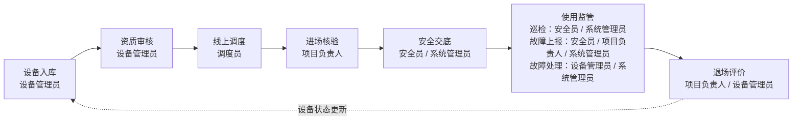

# 3 系统需求分析

## 3.1 系统可行性分析

从技术可行性看，ASP.NET Core MVC、EF Core 和 SQL Server 均为成熟的软件开发技术，能够满足 B/S 管理系统的开发需求。系统所需的用户认证、角色授权、表单提交、数据查询、文件上传、图表展示和文档导出均可以通过现有框架和组件实现。项目采用分层架构组织代码，便于后续维护和扩展。

从经济可行性看，系统主要面向毕业设计和中小规模建筑租赁设备管理场景，开发过程主要使用常见开发工具和开源或社区可用组件。系统通过信息化方式替代部分纸质台账和线下流转过程，可以减少重复登记和人工核对工作，提高设备状态查询、合同流转和安全记录追溯效率。

从操作可行性看，系统采用浏览器访问方式，不需要用户安装专用客户端。系统按照角色划分菜单和操作入口，使设备管理员、调度员、项目负责人和安全员能够根据自身职责完成业务操作。页面采用表单、列表、详情和看板等常见交互方式，符合管理系统用户的使用习惯。

## 3.2 用户角色分析

系统涉及五类用户角色。不同角色拥有不同的业务职责和操作权限，系统通过基于角色的访问控制实现权限隔离。角色划分既要满足业务协同需要，也要避免职责边界过宽导致越权操作。

表3.1 用户角色职责表

| 角色 | 主要职责 | 典型操作 |
|---|---|---|
| 系统管理员 | 负责全局管理、用户管理和完整业务演示能力 | 用户维护、角色分配、账号启停、全流程业务操作 |
| 设备管理员 | 负责设备资产、资质证件、资质审核、故障处理和退场评价 | 设备入库、证件维护、审核通过/驳回、故障受理与关闭、退场评价 |
| 调度员 | 负责用车申请处理、设备排期、合同生成和合同扫描件上传 | 处理申请、筛选可用设备、生成调度单、预览合同、上传合同扫描件 |
| 项目负责人 | 负责项目用车申请、进场核验、退场申请，也可上报故障 | 提交用车申请、输入核验码、发起退场、上报故障 |
| 安全员 | 负责现场安全交底、巡检记录和故障上报 | 创建安全交底、创建巡检记录、上报故障 |

通过角色划分，系统能够将用户管理、设备管理、调度合同、安全监管和项目使用等职责分离，减少越权操作和职责混淆。例如，系统管理员负责全局管理，设备管理员负责设备资产和退场评价，调度员负责调度与合同流转，项目负责人负责项目侧申请和进退场操作，安全员负责现场安全交底、巡检和故障上报。系统的历史追溯主要通过审核记录、操作日志和业务记录完成。

## 3.3 功能性需求分析

系统功能围绕建筑租赁设备全生命周期展开，主要包括用户与认证、设备台账、资质审核、线上调度、合同管理、进场核验、安全交底、使用监管、故障处理、退场评价、首页看板、站内消息和文件访问等模块。

表3.2 系统核心功能需求表

| 模块 | 功能需求 | 说明 |
|---|---|---|
| 用户与认证 | 登录、注销、个人信息、密码修改、用户管理 | 支持用户启停、角色分配和权限控制 |
| 设备台账 | 预置分类选择与筛选、设备入库、图片上传、列表筛选、详情查看、Excel 导出 | 当前系统使用设备分类基础字典，不提供独立分类 CRUD 页面；新建设备进入待审核状态 |
| 资质审核 | 证件维护、到期预警、审核通过、审核驳回 | 证件管理和资质审核仅由系统管理员或设备管理员执行；审核通过后设备可进入空闲状态 |
| 线上调度 | 用车申请、可用设备筛选、调度排期、调度日历 | 根据设备分类、设备状态、资质有效期和租期冲突筛选可用设备 |
| 合同管理 | 合同草稿、在线预览、PDF 导出、扫描件上传 | 上传合同扫描件后，合同状态变为已签署，调度单状态变为已签署，设备状态变为出租中/使用中 |
| 进场核验 | 核验码/二维码展示、核验结果记录、状态推进 | 已签署调度单才能执行进场核验；核验通过后生成核验记录并将调度单推进为进行中 |
| 安全交底 | 富文本交底、参与人系统内签署确认、附件、PDF 导出 | 创建安全交底由安全员或系统管理员执行；签署属于系统内确认留痕，不等同于法律意义电子签章 |
| 使用监管 | 巡检记录、固定巡检项、现场照片 | 巡检创建由安全员或系统管理员执行，巡检照片最多 5 张 |
| 故障处理 | 故障上报、工单接受、维修处理、关闭恢复 | 故障可由安全员、项目负责人或系统管理员上报，故障受理和关闭由设备管理员或系统管理员执行 |
| 退场评价 | 退场申请、评分、损耗扣款、押金退还、设备状态更新 | 退场申请由项目负责人或系统管理员提交，退场评价由设备管理员或系统管理员完成 |
| 首页看板 | 设备统计、租赁趋势、证件预警、角色待办 | 为不同角色提供业务提醒 |
| 站内消息 | 通知提醒、未读消息、跳转链接 | 支持跨角色协同 |
| 文件访问 | 文件上传安全校验、受控下载 | 允许 `.jpg/.jpeg/.png/.pdf`，单文件最大 10 MB，上传文件不直接暴露在静态目录下 |

## 3.4 非功能性需求分析

除功能需求外，系统还需要满足安全性、可维护性、易用性、数据一致性和可追溯性等非功能需求。ISO/IEC 25010:2011 将软件质量划分为功能适合性、性能效率、兼容性、易用性、可靠性、安全性、可维护性和可移植性等方面[7]，这些指标对本系统同样具有参考意义。

在安全性方面，系统需要对用户身份和角色权限进行校验，防止未登录访问和越权操作；对文件上传进行扩展名、MIME 类型、文件魔数和大小限制校验，降低恶意文件上传风险；对富文本内容进行过滤，防止危险脚本进入系统。在可维护性方面，系统采用 MVC 分层架构和 Service 层业务逻辑集中管理，使控制器、服务、实体、视图模型和页面之间职责清晰。在易用性方面，系统采用常见的表单、列表、详情和看板页面，使用户能够快速完成业务操作。在数据一致性方面，系统通过状态字段和服务层规则约束业务流程，避免未审核设备被调度、未签署合同直接核验等问题。在可追溯性方面，系统保存审核记录、合同记录、核验记录、安全交底、巡检、故障和退场评价等过程数据，为责任追踪提供依据。

## 3.5 核心业务流程分析

系统核心业务流程如下：

```text
设备入库 -> 资质审核 -> 线上调度 -> 进场核验 -> 安全交底 -> 使用监管 -> 退场评价
```

系统核心业务流程为“设备入库 -> 资质审核 -> 线上调度 -> 进场核验 -> 安全交底 -> 使用监管 -> 退场评价”。设备管理员首先录入设备基础信息和图片，设备默认进入待审核状态；资质审核通过后，设备状态变为空闲，具备后续调度条件。项目负责人提交用车申请后，调度员根据设备分类、租期、资质有效期和设备状态筛选可用设备，并生成调度单和合同草稿。合同线下签署完成后，调度员上传合同扫描件，系统同步将合同状态置为已签署、调度单状态置为已签署，并将设备状态置为出租中或使用中。项目负责人随后通过核验码完成进场核验，核验通过后系统写入进场核验记录，并将调度单推进为进行中。设备使用期间，安全员或系统管理员可创建安全交底和巡检记录，安全员、项目负责人或系统管理员可上报故障，设备管理员或系统管理员负责故障受理与关闭。租赁结束后，项目负责人发起退场申请，设备管理员填写退场评价，系统完成押金扣款计算并更新调度单和设备状态。

【图3.1 占位：设备租赁全生命周期业务流程图】

获取方法一：使用 Mermaid 转换为图片，推荐在 Markdown 编辑器或 mermaid.live 中导出 SVG/PNG。



获取方法二：使用 GPT-image-2 生成草图，再用 draw.io 或 Visio 重画。Prompt：

```text
Create a clean academic vector-style flowchart for a Chinese undergraduate software engineering thesis. Use a white background, thin black lines, simple rounded rectangles, and left-to-right arrows. Use Simplified Chinese labels exactly: 设备入库, 资质审核, 线上调度, 进场核验, 安全交底, 使用监管, 退场评价. Add small role labels below each stage: 设备管理员, 设备管理员, 调度员, 项目负责人, 安全员/系统管理员, 巡检：安全员/系统管理员；故障上报：安全员/项目负责人/系统管理员；故障处理：设备管理员/系统管理员, 项目负责人/设备管理员. Add a dotted feedback arrow from 退场评价 to 设备入库 labeled 设备状态更新. No icons, no 3D effects, no title inside the image.
```

正式论文图题：
图3.1 设备租赁全生命周期业务流程图

## 3.6 本章小结

本章从可行性、用户角色、功能需求、非功能需求和业务流程等方面对系统需求进行了分析。系统面向建筑租赁设备管理场景，重点解决设备台账分散、资质证件难追踪、合同流转慢、进场核验效率低和安全记录难追溯等问题。通过多角色职责划分和全生命周期业务流程设计，为后续总体设计和系统实现奠定了基础。

---
