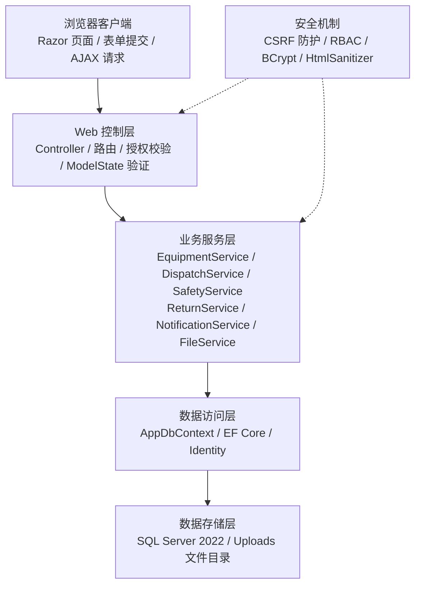
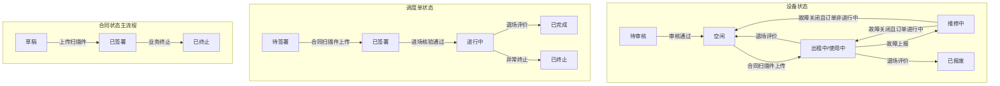

# 4 系统总体设计

## 4.1 系统设计目标与原则

系统设计目标是构建一个面向建筑租赁设备业务的 B/S 架构 Web 管理平台，实现设备从入库到退场的全过程管理。系统不仅需要支持设备基础信息维护，还需要通过资质审核、调度合同、进场核验、安全交底、使用监管和退场评价等模块记录设备租赁全过程。

系统设计遵循以下原则。第一，分层清晰原则。系统采用 Controller、Service、Entity、ViewModel、Razor View 和 AppDbContext 分层结构，避免业务逻辑混杂在页面或控制器中。第二，职责隔离原则。不同角色承担不同业务职责，系统通过角色授权限制用户操作边界。第三，状态驱动原则。设备、用车申请、调度单、合同、故障和退场申请均通过状态字段描述当前阶段，业务动作推动状态变化。第四，数据可追溯原则。系统保存审核、调度、核验、安全交底、巡检、故障和退场评价等过程记录。第五，安全可控原则。系统对用户认证、CSRF、防越权访问、文件上传和富文本内容进行安全处理。

## 4.2 系统总体架构设计

系统采用 ASP.NET Core MVC 分层架构。用户通过浏览器访问系统页面，Razor View 负责展示页面和提交表单，Controller 负责接收请求、执行权限校验和模型验证，Service 层负责业务规则和状态流转，AppDbContext 通过 EF Core 访问 SQL Server 数据库。上传文件保存到 Uploads 目录，并通过 FilesController 鉴权访问，避免直接暴露在静态资源目录中。

【图4.1 占位：系统总体架构图】

获取方法一：使用 Mermaid 生成架构图。



获取方法二：使用 GPT-image-2 生成草图，再手工重画。Prompt：

```text
Create a clean academic layered architecture diagram for a Chinese undergraduate software engineering thesis. White background, horizontal layers from top to bottom. Labels: 浏览器客户端, Web 控制层, 业务服务层, 数据访问层, 数据存储层. Put Razor 页面/表单提交/AJAX 请求 in the first layer; Controller/路由/授权校验/ModelState 验证 in the second; EquipmentService/DispatchService/SafetyService/ReturnService/NotificationService/FileService in the third; AppDbContext/EF Core/Identity in the fourth; SQL Server 2022/Uploads 文件目录 in the fifth. Add side note 安全机制：CSRF 防护, RBAC, BCrypt, HtmlSanitizer. Simple vector style, no icons, no 3D, no title.
```

正式论文图题：
图4.1 系统总体架构图

## 4.3 系统功能模块设计

根据业务流程和角色职责，系统划分为以下功能模块。

用户与认证模块负责用户登录、注销、个人信息维护、密码修改和用户管理。设备台账模块负责设备分类、设备入库、图片上传、列表筛选、设备详情和设备台账导出。资质审核模块负责设备证件维护、证件到期预警、审核通过和审核驳回。线上调度模块负责项目用车申请、可用设备筛选、调度排期和调度日历展示。合同管理模块负责合同草稿生成、在线预览、PDF 导出和合同扫描件上传。进场核验模块负责核验码展示、核验结果记录和业务状态推进。安全交底模块负责富文本交底、参与人签署、附件和 PDF 导出。使用监管模块负责巡检记录、固定巡检项和现场照片。故障处理模块负责故障上报、工单接受、维修处理和关闭恢复。退场评价模块负责退场申请、评分、损耗扣款、押金退还和设备状态更新。首页看板和站内消息模块负责设备统计、租赁趋势、证件预警、角色待办和通知提醒。文件访问模块负责上传文件安全校验和受控下载。

## 4.4 角色权限设计

系统采用 RBAC 权限控制方式，将权限分配给角色，再将角色分配给用户。该方式能够避免直接为每个用户配置大量权限，提高权限管理的清晰性和可维护性[15]。在系统实现中，权限不仅体现在菜单展示上，也体现在 Controller 和 Action 的角色授权上。不同角色只能访问与其职责相关的页面和操作。

表4.1 系统角色权限矩阵

| 模块/操作 | 系统管理员 | 设备管理员 | 调度员 | 项目负责人 | 安全员 |
|---|---|---|---|---|---|
| 用户管理 | 管理 | 无 | 无 | 无 | 无 |
| 设备台账查看 | 查看/管理 | 查看/管理 | 无 | 无 | 无 |
| 设备入库与编辑 | 管理 | 管理 | 无 | 无 | 无 |
| 证件管理 | 管理 | 管理 | 无 | 无 | 无 |
| 资质审核 | 审核 | 审核 | 无 | 无 | 无 |
| 用车申请 | 查看/管理 | 无 | 查看/处理 | 提交/查看 | 无 |
| 调度排期 | 管理 | 无 | 管理 | 无 | 无 |
| 合同预览/PDF | 查看 | 查看 | 查看 | 查看 | 无 |
| 合同扫描件上传 | 上传 | 无 | 上传 | 无 | 无 |
| 进场核验操作 | 核验 | 无 | 无 | 核验 | 无 |
| 安全交底创建 | 创建 | 无 | 无 | 无 | 创建 |
| 安全交底签署 | 签署 | 无 | 无 | 签署 | 签署 |
| 巡检创建 | 创建 | 无 | 无 | 无 | 创建 |
| 故障上报 | 上报 | 无 | 无 | 上报 | 上报 |
| 故障受理/关闭 | 受理/关闭 | 受理/关闭 | 无 | 无 | 无 |
| 退场申请 | 提交 | 无 | 无 | 提交 | 无 |
| 退场评价 | 评价 | 评价 | 无 | 无 | 无 |

该权限设计体现了五类角色之间的职责边界。系统管理员具有全局管理和业务演示能力；设备管理员负责设备资产、资质审核、故障关闭和退场评价；调度员负责用车申请处理、调度排期和合同扫描件上传；项目负责人负责项目侧用车申请、进场核验、退场申请和故障上报；安全员负责安全交底、巡检记录和故障上报。通过将修改类操作限制在对应角色范围内，系统能够降低误操作和越权操作风险。

## 4.5 业务状态流转设计

系统通过状态字段约束业务流程。新建设备默认处于待审核状态，资质审核通过后变为空闲状态；调度排期时系统选择空闲且资质有效的设备生成调度单和合同草稿，此时调度单为待签署状态，合同为草稿状态。合同扫描件上传后，系统将合同状态更新为已签署，将调度单状态更新为已签署，并将设备状态更新为出租中或使用中。进场核验通过后，系统生成进场核验记录，并将调度单推进为进行中。故障上报可使设备进入维修中状态，故障关闭后根据调度单是否仍在进行中恢复为使用中或空闲。退场评价提交后，调度单进入已完成状态，设备根据评价结果更新为空闲、维修中或已报废。合同状态枚举中虽然保留“待签署”状态，但当前主流程中合同由草稿在上传扫描件后直接变为已签署。

【图4.2 占位：主要业务状态流转图】

获取方法一：使用 Mermaid 转换。



注：图中仅表示当前系统主业务流程。合同状态枚举中的“待签署”为保留状态，当前主流程未实际写入，因此未绘入合同主流程图。

获取方法二：使用 GPT-image-2。Prompt：

```text
Create a clean state transition diagram for a Chinese undergraduate software engineering thesis. White background, three horizontal swimlanes. Swimlane 1 title: 设备状态, states: 待审核 -> 空闲 -> 出租中/使用中 -> 维修中, with arrows 维修中 -> 出租中/使用中, 维修中 -> 空闲, 出租中/使用中 -> 已报废. Label the arrow 空闲 -> 出租中/使用中 as 合同扫描件上传, not 进场核验. Swimlane 2 title: 调度单状态, states: 待签署 -> 已签署 -> 进行中 -> 已完成, with branch 进行中 -> 已终止. Label 待签署 -> 已签署 as 合同扫描件上传, and 已签署 -> 进行中 as 进场核验通过. Swimlane 3 title: 合同状态主流程, states: 草稿 -> 已签署 -> 已终止. Do not draw 待签署 in the contract lane; it is only a reserved enum. Use thin arrows, rounded rectangles, large readable Simplified Chinese text, no icons, no title.
```

正式论文图题：
图4.2 主要业务状态流转图

## 4.6 本章小结

本章从设计目标、总体架构、功能模块、角色权限和状态流转等方面进行了系统总体设计。系统采用 ASP.NET Core MVC 分层架构，以 Service 层集中处理业务规则，以 RBAC 实现多角色权限隔离，并通过状态字段约束设备租赁业务流程，为系统详细实现提供了总体设计依据。

---
