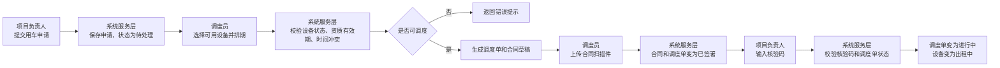
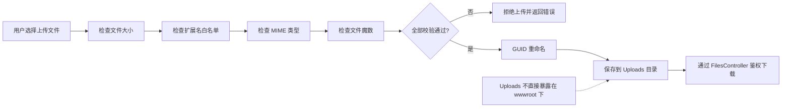

# 6 系统详细设计与实现

## 6.1 用户认证与权限控制实现

用户认证与权限控制是系统安全运行的基础。系统使用 ASP.NET Core Identity 实现用户登录、注销、角色管理和登录失败锁定等功能。用户登录时，系统根据用户名和密码进行身份验证；登录成功后，系统根据用户所属角色展示相应菜单并限制可访问的 Controller 和 Action。未登录用户访问受保护页面时会被引导到登录页面，已登录但无权限用户访问受限功能时会被拒绝。

系统使用 BCrypt 替换 Identity 默认密码哈希实现。BCrypt 通过可配置的计算成本增强密码哈希强度，能够在一定程度上抵抗暴力破解风险[16]。在用户管理模块中，系统管理员可以新增用户、编辑用户信息、分配角色、启用或停用账号。停用账号不能继续正常登录系统。

权限控制采用 RBAC 模型。系统将具体业务操作与角色关联，而不是直接为每个用户分配权限。设备管理员能够管理设备、证件、审核、故障和退场评价；调度员能够处理用车申请、调度排期和合同扫描件上传；项目负责人能够提交用车申请、执行进场核验和发起退场申请；安全员能够创建安全交底、巡检记录和故障上报；只读审计员只能查看记录，不允许执行修改类操作。通过这种设计，系统能够较好地实现职责分离和权限隔离。

## 6.2 设备台账与资质审核实现

设备台账模块用于管理建筑租赁设备基础信息。设备管理员或系统管理员可以录入设备编号、设备名称、设备分类、品牌型号、出厂日期、所属公司、技术参数和备注等信息，并可上传设备图片。系统在创建设备时将设备初始状态设置为待审核，表示设备尚未通过资质审核，不能直接参与后续调度。

设备证件模块用于维护设备合格证、年检报告、保险凭证等资质材料。每条证件记录包含证件类型、证件编号、签发机构、有效期和附件路径等信息。系统首页可以根据证件有效期展示到期预警，提醒设备管理员及时维护证件信息。该设计有助于降低证件过期但设备仍被调度使用的风险。

资质审核模块由设备管理员或系统管理员执行。审核通过后，系统将设备状态从待审核变为空闲，表示设备具备进入调度流程的条件。审核驳回时，系统保存驳回原因和审核记录，设备仍不能进入可调度状态。通过设备状态和审核记录的结合，系统能够把设备基础台账和资质管理流程连接起来，避免设备未审核即参与租赁。

## 6.3 线上调度与合同管理实现

线上调度模块是连接项目需求与设备资源的核心环节。项目负责人根据项目名称、项目地址、设备类型、需求数量、预计开始时间、预计结束时间、联系人和联系电话等信息提交用车申请。申请提交后进入待处理状态，调度员可以在调度列表中查看并处理。

调度员处理申请时，系统根据设备分类、设备状态、资质有效期和租期冲突情况筛选可用设备。只有状态为空闲、资质满足要求且租期不冲突的设备才能被选中生成调度单。调度单保存实际租期、日租金、押金、调度员和核验码等信息。生成调度单后，系统同步生成合同草稿，合同包含合同编号、设备信息、项目需求、租期、费用和押金等内容。

合同管理模块支持合同在线预览和 PDF 导出。合同线下签署完成后，调度员上传合同扫描件。扫描件上传成功后，系统将合同状态推进为已签署，并同步将调度单状态推进为已签署。该设计将线下签署结果和线上业务状态连接起来，为后续进场核验提供前置条件。

【图6.1 占位：线上调度与进场核验流程图】

获取方法一：Mermaid 转换。



获取方法二：GPT-image-2 生成草图。Prompt：

```text
Create a clean business flowchart for a Chinese undergraduate software engineering thesis. White background, left-to-right flow, simple rounded rectangles and one decision diamond. Steps: 项目负责人提交用车申请; 系统保存申请，状态为待处理; 调度员选择可用设备并排期; 系统校验设备状态、资质有效期、时间冲突; decision 是否可调度; 否 -> 返回错误提示; 是 -> 生成调度单和合同草稿; 调度员上传合同扫描件; 合同和调度单变为已签署; 项目负责人输入核验码; 系统校验核验码和调度单状态; 调度单变为进行中，设备变为出租中. Clean vector style, Simplified Chinese, no icons, no title.
```

正式论文图题：  
图6.1 线上调度与进场核验流程图

## 6.4 进场核验实现

进场核验模块用于确认已签署合同的设备是否可以进入现场使用阶段。系统在调度单中保存 GUID 核验码，并可通过二维码方式展示，便于项目负责人在设备进场时进行核验。需要注意的是，本系统实现的是系统内核验码和二维码展示，并未接入真实硬件扫码设备。

项目负责人输入核验码后，系统服务层检查调度单状态、核验码是否匹配、设备状态是否满足要求以及相关证件是否有效。只有调度单处于已签署状态并通过相关校验后，核验才会成功。核验通过后，系统生成进场核验记录，将调度单状态推进为进行中，并将设备状态变为出租中。若核验失败，系统保存失败原因，便于后续查看和追溯。

该模块将传统人工核对流程转化为系统校验流程，能够降低核验过程中的人工疏漏。同时，核验记录与调度单、设备和操作人关联，使设备进场过程具有可追溯性。

## 6.5 安全交底与使用监管实现

安全交底模块用于记录设备进场后的现场安全管理资料。安全员可以创建安全交底记录，填写交底日期、地点、富文本交底内容、参与人和附件等信息。系统在保存富文本内容前使用 HtmlSanitizer 过滤危险 HTML，降低 XSS 攻击风险。交底参与人可以进行签署确认，系统记录签署时间和相关信息，使安全交底过程能够被查询和追溯。

使用监管模块主要包括巡检记录和固定巡检项。安全员或设备管理员可以针对进行中的调度单新增巡检记录，记录检查日期、整体状态、备注和现场照片。巡检项采用固定清单方式，例如外观、液压、电气、紧固件、安全装置、控制装置、作业环境和操作记录等。系统根据巡检项结果汇总整体状态，为设备使用过程监管提供结构化记录。

当巡检或现场使用过程中发现设备异常时，安全员可以发起故障上报。故障记录包括故障描述、严重程度、现场图片、处理状态和处理结果等。通过安全交底、巡检和故障记录的结合，系统能够记录设备使用过程中的安全管理活动，为后续退场评价和责任追溯提供依据。

## 6.6 故障处理与退场评价实现

故障处理模块用于管理设备使用过程中的故障工单。安全员上报故障后，故障工单进入待处理状态，设备管理员可以接受并处理工单。故障处理过程中，设备状态可能由出租中变为维修中。设备管理员填写处理结果、维修费用等信息后关闭工单，系统根据业务情况恢复或更新设备状态。通过工单状态变化，系统能够记录故障从上报、处理到关闭的完整过程。

退场评价模块是设备租赁流程的收尾环节。项目负责人在设备使用结束后发起退场申请，填写实际退场日期和设备状况描述。设备管理员收到退场申请后进行退场评价，填写外观评分、功能评分、损耗描述和损耗扣款。系统根据押金和扣款金额计算退还金额，避免完全依赖前端输入。提交评价后，系统将退场申请状态变为已完成，将调度单状态推进为已完成，并根据评价结果更新设备后续状态，例如空闲、维修中或已报废。

退场评价模块通过评分、扣款和押金退还计算，将设备使用结果转化为结构化记录。该模块不仅完成租赁业务闭环，也为设备后续维护和租赁决策提供参考。

## 6.7 首页看板、站内消息与文件安全实现

首页看板模块用于聚合系统关键数据。系统展示设备总数、出租中设备、空闲设备、维修中设备和待审核设备等统计卡片，并通过图表展示近几个月租赁趋势。系统还根据角色展示不同待办入口，例如设备管理员关注待审核设备和故障工单，调度员关注待处理用车申请，安全员关注安全交底和巡检任务。

站内消息模块用于提升跨角色协作效率。系统在审核、调度、交底、故障和退场等关键业务节点生成通知消息，用户可以查看未读消息并跳转到相关页面。该设计有助于减少线下沟通遗漏，使业务节点能够及时传递给相关角色。

文件安全访问模块用于处理设备图片、证件附件、合同扫描件、安全交底附件、巡检照片和故障图片等上传文件。系统对上传文件进行扩展名白名单、文件大小、MIME 类型和文件魔数校验，并使用 GUID 重命名文件，降低重名覆盖、路径穿越和伪装文件风险。上传文件保存到 Uploads 目录，不直接放在 wwwroot 静态资源目录下，文件下载统一经过 FilesController 鉴权后返回。该设计符合 OWASP 对文件上传安全的基本建议[18]。

【图6.2 可选占位：文件上传安全校验流程图】

获取方法一：Mermaid 转换。



获取方法二：GPT-image-2 生成草图。Prompt：

```text
Create a clean security validation flowchart for a Chinese undergraduate software engineering thesis. White background, left-to-right flow. Steps: 用户选择上传文件, 检查文件大小, 检查扩展名白名单, 检查 MIME 类型, 检查文件魔数, GUID 重命名, 保存到 Uploads 目录, 通过 FilesController 鉴权下载. Add failure branch: 任一校验失败 -> 拒绝上传并返回错误. Add side note: Uploads 不直接暴露在 wwwroot 下. Simple vector style, no icons, no title.
```

正式论文图题：  
图6.2 文件上传安全校验流程图

## 6.8 本章小结

本章围绕系统核心功能实现进行了说明。系统通过 Identity 和 RBAC 实现用户认证与权限隔离，通过设备台账和资质审核约束设备可用性，通过调度合同和进场核验推进租赁流程，通过安全交底、巡检和故障处理记录使用过程，通过退场评价完成业务闭环。同时，系统通过首页看板、站内消息和文件安全机制提升可用性、协作效率和安全性。

---
